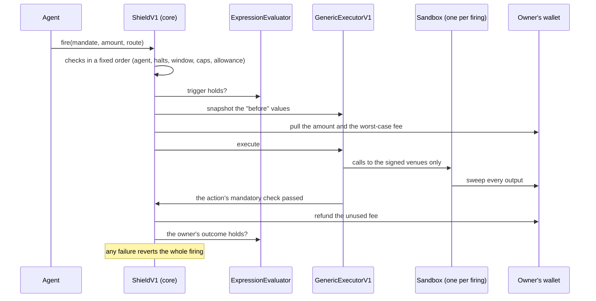

# Signo Shield

Let an AI agent act on your wallet, inside limits you signed on chain.

The owner signs a **mandate**: which agent, which action, which asset, how
much per firing and in total, until when, through which venues, when it may
fire, and what result counts as success. The agent fires the mandate through
the Shield. The contract enforces the **bound**; the agent decides the
**action** inside it.

- Funds stay in the owner's wallet until a firing. The agent never holds them
  and never gets an allowance.
- A generic firing runs in a fresh single-use sandbox that can call only
  the venues the owner signed, and sweeps everything back to the owner.
- The result is measured on the owner's own balances and positions. There is
  no calldata parser to fool. If the result breaks the mandate, the whole
  transaction reverts and nothing moves.

**Status.** Shield v1 is live on X Layer (chain 196) since 24 September 2026.
The contracts have had fifteen review rounds, not an external audit.

## One sentence, one mandate

An owner types this into Signo:

> If USD₮0 loses its peg, or ETH or BTC falls 8% below today's price, move a
> quarter of my USD₮0 into USDC if the peg broke, otherwise into the coin
> that crossed its line.

The app compiles it into one mandate, and the owner signs it once:

- **When** (checked on chain, from Chainlink feeds): USD₮0 below $0.99, or
  ETH below its line, or BTC below its line. The app turns "loses its peg"
  and "8% below today" into exact numbers and shows them before signing.
- **Then**: sell USD₮0; buy USDC, xETH or xBTC. Whatever arrives must be
  worth at least what was sold, at the oracle price, less the owner's
  slippage. The value is checked on chain.
- **Limits**: a per-firing cap, a lifetime cap, an expiry and the one swap
  venue.

When a line is crossed, the agent reads which condition holds, picks the
output, and sizes the trade from the wallet balance. The Shield checks the
result. Even if the agent went rogue, it could only do this one thing,
within these limits.

## How a firing works



The full sequence, with every reason code, is in
[`docs/ARCHITECTURE.md`](docs/ARCHITECTURE.md).

## What an owner can sign

| Action | What the contract checks |
| --- | --- |
| Swap, one or several outputs | The value that arrived, at the oracle, is at least the value sold less the signed slippage. Or a fixed minimum, the vault's own quote for an ERC-4626 deposit, or, for a token with no price feed, only the caps and that something signed arrived |
| Transfer | The amount reached the one signed recipient |
| Vault withdrawal | At least the vault's quote less the slippage, with an optional floor |
| Aave supply, repay | The aToken balance rose; the debt fell |
| Aave repay from collateral | Judged on the health factor before anything moves; each firing must raise it, until the signed target |
| Claim rewards | Listed claim rules only; every declared reward reaches the owner |

A trigger and an extra outcome check are expression trees over a listed
catalog of reads: prices, balances, health factors, vault rates.

## Deployed

Shield v1 on X Layer (chain 196), source commit `9acaa6f`, verified on
Sourcify:

| Contract | Address |
| --- | --- |
| ShieldV1 (core) | `0xd64807a7207D62d8F3E14aC1e05dB9fD1f1500CB` |
| ShieldRegistryV1 | `0xE87b50B7E3e996a0C60B4a24221FE44B4277272A` |
| ExpressionEvaluator | `0xaB964864f6436A15445279e41C7C99985B9eCcb5` |
| GenericExecutorV1 | `0x41817086D841E146F52E95BA85C68DE541654f18` |
| AaveV3AdapterV1 | `0x78749F9bfB020358050a2EeB53aD5234C4B840b5` |
| ClaimExecutorV1 | `0x2434AC952990C0C78940D92362354A26E673DB0E` |

Every address, with its deploy transaction and source commit, is in
[`deployments/manifest.json`](deployments/manifest.json). The v0.1 contracts
stay deployed beside v1.

## Documents

| Document | What it covers |
| --- | --- |
| [`docs/DESIGN-HISTORY.md`](docs/DESIGN-HISTORY.md) | How the design got here in nine days: v0.1, the generic executor, why v1, and what each of the fifteen review rounds changed |
| [`docs/ARCHITECTURE.md`](docs/ARCHITECTURE.md) | How v1 works: the contracts, the mandate, the firing, the executors, triggers and outcomes, emergency controls |
| [`docs/TRUST.md`](docs/TRUST.md) | Who can do what, what each action checks, what a leaked key can do, known limits |
| [`docs/APP-SIDE.md`](docs/APP-SIDE.md) | What the Signo app does around the contracts, when it was built, and every mainnet firing |
| [`docs/TESTS.md`](docs/TESTS.md) | The 499 tests, and what each suite proves |
| [`docs/REUSE.md`](docs/REUSE.md) | Third-party code and its licences |

## Build and test

Requires [Foundry](https://book.getfoundry.sh/getting-started/installation).
Nothing else: no private registry, no API keys, no database.

```bash
git clone --recursive https://github.com/FlipLabsAI/signo-shield
cd signo-shield
forge build
forge test
```

If you cloned without `--recursive`:

```bash
git submodule update --init --recursive
```

`forge test` runs 499 tests: unit suites, the independent reviewer's suites
under `test/review/`, and fork suites against real Aave V3 markets, real
Chainlink rounds, a real aggregator route and a real Pendle reward claim on
X Layer, plus Arbitrum One and Ethereum mainnet for v0.1. The fork suites
read public archive endpoints; `XLAYER_RPC_URL`, `ARBITRUM_RPC_URL` and
`MAINNET_RPC_URL` override them, and
`forge test --no-match-path "test/fork/*"` skips them offline.
`tools/okx-fixture.py` regenerates the recorded aggregator calldata with an
API key of that aggregator; the suite itself needs none. CI runs the build,
the tests, `forge fmt --check` and a check that `abi/` is current on every
push.

## Layout

```
contracts/v1/          Shield v1: core, registry, evaluator, executors, Aave adapter, sandbox
contracts/core/        v0.1: the Shield, the condition modules and their interfaces
contracts/executors/   v0.1: the generic executor and its sandbox
contracts/adapters/    v0.1: the pinned Aave V3 adapter
test/v1/               v1 unit suites
test/review/           the independent reviewer's suites, imported as written
test/fork/             pinned-chain suites, v0.1 and v1
test/                  v0.1 unit suites and mocks
script/                deploy scripts (DeployV1 for v1) and the v0.1 register-and-fire demo
tools/                 artifact export, a v0.1 fork demo, the aggregator fixture generator
abi/                   generated ABIs, checked in so they can be read without the toolchain
deployments/           the manifest keyed by chain id, generated from broadcast files
docs/                  design, trust, tests, app side, reuse
```

## Artifacts

ABIs and the deployments manifest are generated, never written by hand:

```bash
forge build
python3 tools/export-artifacts.py               # ABIs into abi/
python3 tools/export-artifacts.py --deployments # plus deployments/manifest.json
```

CI fails if `abi/` is stale, because a public repository that ships an ABI
which does not match its bytecode is worse than one that ships none.

## What pre-existed this repository, and what was added

Stated plainly, so provenance can be read without asking.

**Pre-existed.** The first design idea (bounded execution checked by
post-conditions, a disposable sandbox, one generic condition module, pinned
adapters as the exception) was worked out by Flip Labs before this
repository was started. The off-chain half that the contracts serve also
pre-existed: the Signo app, its intent schema, its encoder catalogue and its
alerting. They are not in this repository.

**Added in this repository, from 16 September 2026.** Everything in it: the
Foundry project, the interfaces as written here, both contract generations,
the tests, the deploy scripts, the artifact export and CI. The app-side work
built for the Shield in the same period is listed, with build numbers and
mainnet transactions, in [`docs/APP-SIDE.md`](docs/APP-SIDE.md).

**Reused from third parties.** OpenZeppelin Contracts v5.7.0 (MIT) and
forge-std as a test-time dependency. No third-party contract code has been
copied or adapted. [`docs/REUSE.md`](docs/REUSE.md) records both.

## Licence

MIT. See [`LICENSE`](LICENSE).
