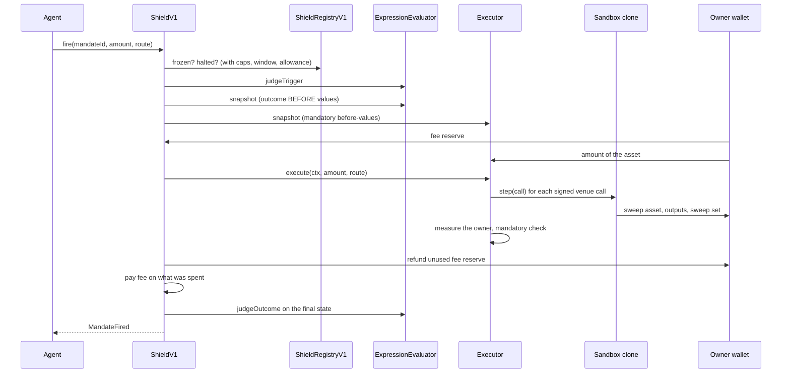

# Signo Shield v1: architecture

Shield v1 lets an owner give an agent a bounded job on the owner's wallet. The
owner signs a mandate from their own wallet. The mandate names the agent, the
action, the token the action may spend, the caps, the validity window, the
exact contracts the action may call, the rule that judges the result, and
optionally a trigger and an outcome check. The agent decides when to fire,
how much to spend within the caps, which route to take through the signed
contracts and, when the owner signed several outputs, which one to buy. The
contract does not trust those decisions. It checks every firing, and a firing
that fails a check reverts as a whole.

This page describes the mechanism, with the contract and function names so
each claim can be checked in `contracts/v1/`. Who can do what, and what a
leaked key can do, is in [`TRUST.md`](TRUST.md). The deployed addresses
are in [`deployments/manifest.json`](../deployments/manifest.json). How the
design got here is in [`DESIGN-HISTORY.md`](DESIGN-HISTORY.md).

## The contracts

| Contract | Job | Runtime size |
| --- | --- | --- |
| `ShieldV1` | The core. Holds every mandate, pulls only the mandate's asset within the caps, hands it to the executor, measures what left the owner, settles the fee, judges the outcome. | 17,436 bytes |
| `ShieldRegistryV1` | Executor and evaluator listings, the read catalog (descriptors), price rounds, claim rules, and the emergency controls. | 12,282 bytes |
| `ExpressionEvaluator` + `ExprLib` | Judges trigger and outcome trees over listed reads. Stateless; every function is a view. | 11,706 bytes |
| `GenericExecutorV1` | Funded actions that know no protocol: transform (swap, deposit), transfer, redeem, repay. Runs the agent's calls in a sandbox. | 24,452 bytes |
| `DisposableCloneV1` | The sandbox template. One minimal-proxy clone per firing. | 2,835 bytes |
| `AaveV3AdapterV1` | Aave v3 supply, repay, and repay from collateral, each with its own check. | 15,055 bytes |
| `ClaimExecutorV1` | Collects listed rewards to the owner. Pulls nothing. | 11,377 bytes |

Sizes are from `forge build --sizes` at the deployed source commit. The
contract size limit is 24,576 bytes.

**Why the registry is a separate contract.** The first v1 core held the
listings, the catalog and the emergency controls too, and had 163 bytes to
spare. The split moved them into `ShieldRegistryV1`, so the core keeps its
byte budget for the firing sequence. The core is bound to one registry at
construction (`ShieldV1.registry`) and consults it at registration and at every
firing. The registry's owner is also the core's admin (`ShieldV1.onlyAdmin`
reads `registry.owner()`), so there is one admin. Every contract is immutable.
A change is a new version.

## The mandate

The owner calls `ShieldV1.registerMandate(MandateParams)`. The fields are in
`IShieldV1.MandateParams`:

| Field | Meaning |
| --- | --- |
| `agent` | The one address that may call `fire`. Not the owner, not the core. |
| `executor`, `evaluator` | Must be listed in the registry at registration. |
| `asset` | The one token the core may pull from the owner. |
| `maxTransactionValue`, `maxCumulativeValue` | The per-firing cap and the lifetime cap. The fee counts inside the lifetime cap. |
| `validFrom`, `validUntil` | The validity window. |
| `maxFeeBps` | The highest fee the owner accepts. Registration fails if the current fee is higher. |
| `funding` | `PULL` (the core pulls `amount` of the asset) or `NONE` (claims only; nothing is pulled). |
| `action`, `actionConfig` | The action (for example `generic.transform`) and its signed configuration: venues, outputs, the rate rule, slippage, price rules. The executor validates it (`validateConfig`). |
| `trigger`, `outcome` | Optional expression trees, validated by the evaluator. |

At registration the core also stamps the current `feeBps` into the mandate
and keeps it for life, and it captures the values that the trees' `SIGNED`
nodes name (`ExpressionEvaluator.capture`). A trigger such as "8 % below the
price at signing" compares a live read with that captured value. The mandate
id is `keccak256(chainid, core, principal, nonce)`.

**Amendment** (`ShieldV1.amendMandate`, owner only). The executor, the
evaluator, the asset, the funding mode and the action cannot change
(`FieldImmutable`). The agent, the caps, the window, the fee ceiling, the
action config and the trees can. The lifetime cap cannot drop below what is
used. The stamped fee stays and must fit the new ceiling. A changed config or
tree is validated as new; an unchanged one keeps working through a descriptor
the admin has since delisted, but never through a revoked one. A changed tree
has its `SIGNED` values taken again.

**Revocation.** `ShieldV1.revokeMandate` from the owner, or
`ShieldV1.revokeWithSig` with the owner's EIP-712 signature (an EOA by
recovery, a contract wallet by ERC-1271), so anyone can submit a revocation
the owner signed. Revocation is permanent.

## A firing

The agent calls `ShieldV1.fire(mandateId, amount, route)`. The route is opaque
to the core and is handed to the executor. The steps, in the order the code
runs them:

1. **Checks** (`ShieldV1._check`, the same sequence `canFireBy` reports). The
   first failure reverts with `MandateBlocked(mandateId, reason)`:
   `NONEXISTENT`, `AGENT_FROZEN`, `NOT_AGENT`, `EXECUTOR_HALTED`,
   `EVALUATOR_HALTED`, `NOT_YET_VALID`, `EXPIRED`, `REVOKED`; then for
   funding `NONE` only `AMOUNT_NOT_ZERO`; for funding `PULL`: `ZERO_AMOUNT`,
   `OVER_TX_CAP`, `OVER_CUMULATIVE_CAP` (the amount plus the worst-case fee
   must fit what is left), `INSUFFICIENT_ALLOWANCE`, `INSUFFICIENT_BALANCE`.
2. **Trigger.** If the mandate has one, `judgeTrigger` must return true, else
   `TRIGGER_NOT_MET`. Nothing has moved yet.
3. **Snapshots, before any pull.** The outcome's `BEFORE` values
   (`ExpressionEvaluator.snapshot`) and the executor's own mandatory
   before-values (`IExecutorV1.snapshot`: a debt and a collateral read, a
   vault quote, a health factor). The pull cannot change them.
4. **Funding** (`_fund`). The core adds the amount and the worst-case fee to
   the used budget, pulls the fee reserve to itself, records the owner's
   asset balance, then pulls `amount` to the executor.
5. **Executor** (`_runExecutor`). The executor runs the action and its
   mandatory check. Any executor revert becomes
   `OutcomeRejected(mandateId, OUTCOME_FAILED, detail)` with the executor's
   error as the detail.
6. **Settle** (`_settle`). The core measures what left the owner. The exact
   spend rule: the measured outflow and the executor's report must each be at
   most `amount`, and the larger is charged. The unused fee reserve goes back
   to the owner first; then the fee on what was spent goes to the fee
   recipient, capped at what the core still holds. (An Aave aToken rounds
   each transfer, so the core can be one unit short; that unit comes off the
   fee, never off the owner's refund.) The used budget is corrected to the
   real spend plus fee.
7. **Outcome.** If the mandate has one, `judgeOutcome` runs on the owner's
   final state, else `OutcomeRejected(..., OUTCOME_FAILED, "")`.
8. **Receipt.** `MandateFired(mandateId, agent, executor, action, amount,
   spent, fee)`.

A revert at any step undoes every step, so a failed firing moves nothing and
charges no fee. The core has no cooldown; when to fire is decided off chain.

## Executors and their checks

An executor answers `semanticsOf(action)`. The core accepts only known
semantics (`SemanticsV1`: transform, transfer, redeem, repay, claim collect,
claim compose) and fails closed on anything else. Funding `NONE` is allowed
only for the claim semantics. Each executor runs its mandatory check itself;
the owner's outcome tree is judged by the core in addition.

### The sandbox

`GenericExecutorV1` and `ClaimExecutorV1` run every firing in a fresh
`DisposableCloneV1`, deployed at a deterministic address per mandate and
firing (`nextClone` predicts it, so a route can be quoted for it). For the
generic executor, the route is `abi.encode(Call[])`, at most 16 calls and
8,192 bytes (`_decodeRoute`). For each call, `_runSandbox` requires that:

- the `(target, spender)` pair is one of the venue pairs the owner signed
  (`_venueAllowed`);
- neither is suspended or revoked in the registry;
- an approved token is the asset, an output, or in the signed sweep set.

`DisposableCloneV1.step` approves at most what the clone holds, makes the
call, and clears the approval. `finish` sweeps the asset, every output and the
sweep set to the owner and proves each balance is zero. After the sweep,
anyone may call `sendToOwner` to send any other token the used clone holds,
and it pays only that owner. At admission (`validateConfig`) a venue may not
be the asset, an output, the core, the executor, the clone template, or an
address with no code. The exceptions are a redeem and a vault deposit, where
the vault itself is the only venue.

### Transform (`generic.transform`)

The owner sells the asset for `tokenOut`, and optionally for up to four
further outputs (`moreOuts`, `MAX_MORE_OUTS`). What was spent is the amount
less what came back to the owner. Each output is measured as the rise in the
owner's balance. Nothing spent reverts `NothingSold`. The rate rule
(`RateKind`) decides the check:

| Rule | Check at firing |
| --- | --- |
| `Fixed` | at least `spent x rate` of `tokenOut`, less a rounding tolerance of one basis point plus one unit |
| `Oracle` | the value of everything that arrived is at least the value sold less the signed slippage |
| `Floor` | a signed minimum per firing; with several outputs, each output counts as its share of its own floor, and the shares must add up to one |
| `Erc4626` | at least the vault's exact pre-call `convertToShares(amount)` less the slippage; the quote must be at least 100 raw share units (`QuoteTooSmall`) |
| `Unpriced` | at least one raw unit of a signed output |

Under `Oracle`, `_transform` reads a value per raw unit for every output and
for the asset before the route runs, and the same numbers judge what arrived,
so a route cannot move the prices it is judged by. The unit value is
`price x 10^(18 - decimals)` from the oracle the owner signed
(`_unitValue`), so it is exact. A token with more than 18 decimals is refused
at admission and at a firing. Each priced token also carries a signed price
rule: the Chainlink round the registry bound for that token at signing, or
the explicit no-round mode when the registry binds none
(`ExprLib.priceRoundsMatch`). At a firing that round must be fresh and
positive (`ExprLib.requireFreshPrice`). The signed oracle is itself checked
against suspension. Several outputs under `Oracle` or `Floor` must be tokens
the registry bound a price round for (`_reviewed`), so two addresses over one
balance cannot be counted twice.

`Unpriced` is the owner's explicit opt-in for tokens with no feed. No oracle,
rate, floor, slippage, override or price rule may be signed with it
(`ConfigInvalid("unpriced")`). The caps are the whole loss bound. "Arrived"
means a reported balance increase, so a rebasing token can show one without a
purchase.

Slippage is capped at 1 % (`MAX_SLIPPAGE_BPS`) unless the owner signs an
override, and then at 10 % (`MAX_SLIPPAGE_OVERRIDE_BPS`).

### Transfer (`generic.transfer`)

The amount goes to the one recipient the owner signed. There is no route and
no venue (a transfer that signs a venue is refused). The recipient's balance
must rise by the full amount, so a token that charges a transfer fee fails.

### Redeem (`generic.redeem`)

The asset is an ERC-4626 vault share and the output is its underlying. The
only venue is the vault. The owner must receive at least the exact pre-call
`convertToAssets(amount)` (scaled down for a partial redemption) less the
slippage. An optional floor compares a signed sample (shares and their value
at signing) with the vault now: at signing both edges of the band apply, at a
firing only the lower edge, before and after the call.

### Repay (`generic.repay`)

The debt read must be `balanceOf` on a debt token whose
`UNDERLYING_ASSET_ADDRESS` is the asset, with the same decimals. The core
snapshots the debt and the collateral before the pull. After the calls, the
debt must have fallen by at least what was spent less the slippage
(`DebtNotReduced`), and the collateral must not have fallen
(`CollateralFell`).

### Aave v3 (`AaveV3AdapterV1`)

The pool is fixed at construction and checked against suspension at every
firing.

- **Supply** (`aave-v3.supply`): the owner's aToken balance rises by the
  amount, within a rounding tolerance.
- **Repay** (`aave-v3.repay`): the variable debt falls by what was repaid;
  anything not needed goes back to the owner.
- **Repay from collateral** (`aave-v3.repayWithCollateral`): the asset is the
  collateral aToken. The adapter withdraws, sells through the signed router
  and spender with the agent's route, and requires at least the Aave-oracle
  value less the slippage, with both prices passing their signed fresh
  rounds. It re-supplies what it did not sell and repays. The snapshot is the
  owner's health factor before the core pulls anything. A firing is refused if
  that health factor is already at the signed target; the debt must fall; and
  the health factor after the firing must be higher than before it. Near a
  health factor of 1, one firing cannot reach the target, so later firings
  step the rest.

### Claim (`claim.collect`, `ClaimExecutorV1`)

Funding `NONE`: nothing is pulled and the agent sends no route. The mandate
signs up to eight listed claim rules and up to eight reward tokens. At a
firing the executor builds each claim call itself from its rule, with the
owner's address written into the owner arguments, and runs it in a sandbox. A
revoked rule or a blocked venue stops it. Each reward token must reach the
owner by more than the signed dust and by at least the claimable amount read
before the claims, less the dust. Claim-and-reinvest (`claim.compose`) is not
offered by this executor.

## Triggers and outcomes

A tree is `abi.encode(Read[] reads, Node[] nodes)` (`ExprLib`). A node refers
only to nodes with a smaller index, the last node is the root, and the root
must be Boolean. The node kinds are `CONST`, `READ`, `SIGNED` (the value taken
at signing), `BEFORE` (outcome only: the value taken before the pull),
`AMOUNT`, arithmetic (`ADD`, `SUB`, `MUL`, `DIV`, `MIN`, `MAX`), comparisons
(`LT`, `LE`, `GT`, `GE`, `EQ`) and `AND`, `OR`, `NOT`. Numeric and Boolean
nodes cannot mix. Arithmetic is checked `int256`; overflow and division by
zero revert. A tree has at most 16 reads, 64 nodes and 12,288 bytes.

**The read catalog.** A read names a descriptor and supplies only its
arguments. The descriptor (`IDescriptors.Descriptor`) fixes everything that
could misdescribe the read: the contract (or, for a `Shape` descriptor, any
contract that answers a standard interface such as `balanceOf`), the
selector, which argument is the account, which return word is the value, its
signedness and decimals, the freshness rule, and the gas and copy bounds. A
descriptor's id is the hash of its contents, so nothing can be replaced under
an id. The admin lists descriptors for new mandates; delisting stops new
registrations only; an enforcer's revocation stops every firing that reads
through it. A read about an account must name the owner, unless the tree
names another account on purpose (`SubjectMismatch`). A `Shape` read pins the
instance's decimals at signing.

**Price rounds.** A Chainlink descriptor checks the round: the update is not
in the future and not older than `maxAge`, the round is complete, and the
answer is positive. `DeployV1` binds the six X Layer Chainlink feeds (ETH,
BTC, USDT, USDC, OKB, SOL) as price rounds with `FEED_MAX_AGE = 25 hours`:
the feeds' 24-hour heartbeat plus one hour.

**The health factor marker.** An unsigned value above the `int256` range is
refused (`ValueOutOfRange`). The one exception: a descriptor flagged
`unboundedTop`, which the registry accepts only on word 5 of Aave's
`getUserAccountData` (the health factor), reads exactly `type(uint256).max`
("no debt") as the top of the range, so it is above every limit. The
executors refuse a flagged read anywhere it would be an amount.

**An unreadable read.** Every read failure reverts (`ReadFailed`,
`ReadTooShort`, `ReadStale`, `ReadNotPositive`, `ValueOutOfRange`). It never
turns into true or false. A trigger that cannot be read blocks the firing.
Registration makes one liveness read per read, so a tree that cannot be read
is refused at signing. At every judgement the evaluator runs the shape checks
again, rebinds the owner, and checks that every descriptor the tree names,
live or captured, is not revoked and its target is not blocked.

## Emergency controls and the admin

In `ShieldRegistryV1`:

| Control | Who | Effect | Restore |
| --- | --- | --- | --- |
| `freezeAgent` | enforcer | the agent cannot fire any mandate | `unfreezeAgent`, enforcer |
| `halt` | enforcer | every mandate that pins this executor or evaluator stops | enforcer `queueUnhalt`, then admin `executeUnhalt` 24 hours later |
| `suspend` | enforcer | no executor calls, approves or reads through this address | enforcer `queueLift`, then admin `executeLift` 24 hours later |
| `revoke` | enforcer | the same, permanently | none |
| `revokeDescriptor`, `revokeClaimRule` | enforcer | no firing reads through it or makes that claim | none |

A new halt or suspension increases its epoch and cancels a queued
restoration (`RESTORE_DELAY = 24 hours`). The admin is the registry owner
through `Ownable2Step`: ownership moves in two steps and cannot be renounced,
and the admin cannot be an enforcer. The admin lists executors, evaluators,
descriptors, claim rules and price rounds for new mandates, appoints
enforcers, and sets the fee (at most 10 %, `MAX_FEE_BPS`) and the fee
recipient on the core. A fee change reaches new mandates only. `DeployV1`
sets the fee at 10 basis points by default (`SHIELD_FEE_BPS`). With no fee
recipient set, no fee is charged.

## Limits

- One asset per mandate: the only token the core pulls.
- A transform delivers `tokenOut` and at most four further outputs.
- Under the oracle rule, every priced token has 18 decimals or fewer.
- Under `Unpriced`, the caps are the whole loss bound.
- At most 16 calls and 16 venue pairs per firing; 16 reads and 64 nodes per
  tree; 8 claim rules and 8 reward tokens per claim mandate.
- The contract has no cooldown. The Signo app fires a trigger once per
  crossing: the condition must turn false before the app fires it again.
- `GenericExecutorV1` is 124 bytes under the contract size limit, so a new
  semantics is a new executor, listed by the admin, not a change to this one.
